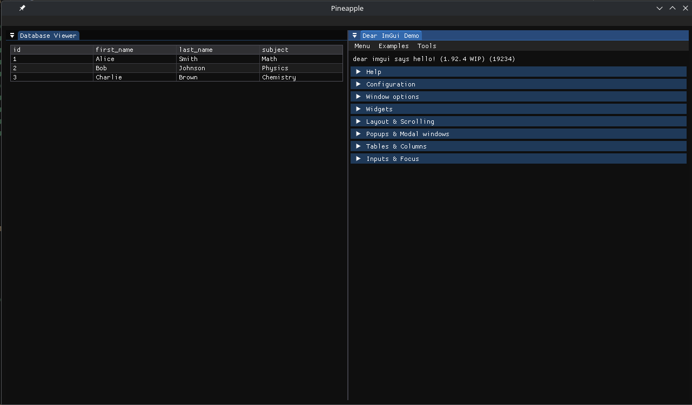

# Pineapple

cross platform, (maybe)

useing mariadb connector right now because that is what arch has by default.
for now, this will only work with maria becuse the is the best open src opion i have.

I need to fix up a lot of the structure. but i have an idea of how this will work

may have to deal with open gl, too

this is also only tested on linux.

to build run the build_vendor first. then build_pineapple. the .sh of build_pineapple can take ninja as arg

exe is in build/bin/
